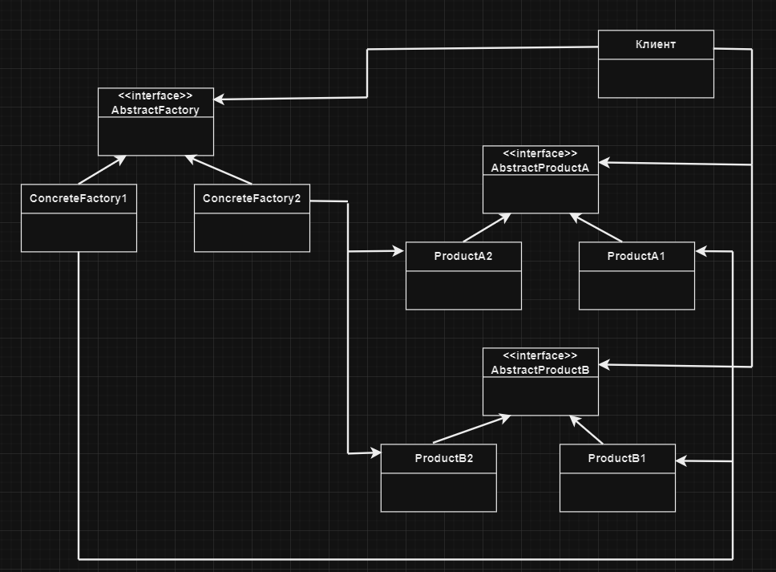

# Абстрактная фабрика | Abstract Factory

# Определение:
**Паттерн Абстрактная Фабрика** предоставляет интерфейс создания семейств взаимосвязанных 
или взаимозависимых объектов без указания их конкретных классов.

# Диаграмма классов:

</h2>