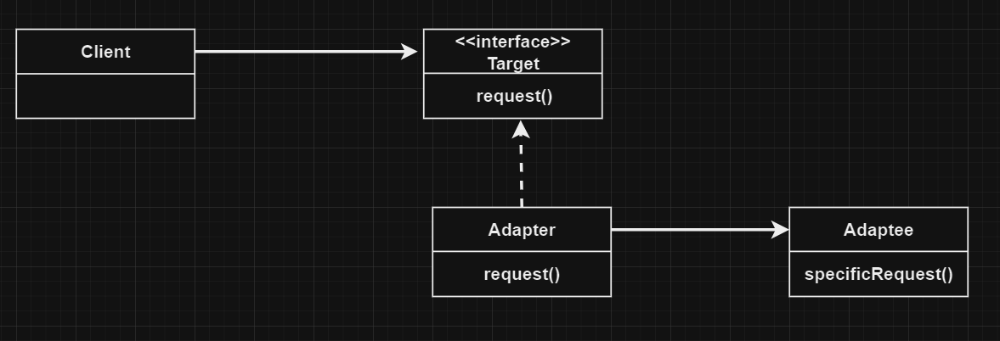

# Абстрактная фабрика | Abstract Factory

# Определение:
**Паттерн Адаптер** преобразует интерфейс класса к другому интерфейсу, на который рассчитан клиент.
Адаптер обеспечивает совместную работу классов, невозможную в обычных условиях из-за несовместимости
интерфейсов.

# Диаграмма классов:

</h2>