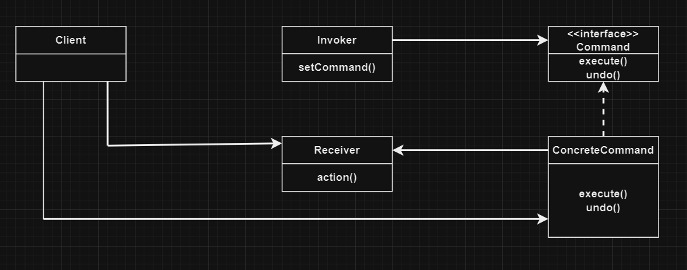

# Команда | Command

# Определение:
**Паттерн Команда** инкапсулирует запрос в виде объекта, делая возможной параметризацию клиентских
объектов с другими запросами, организацию очереди или регистрацию запросов, а также поддержку 
отмены операции.

# Диаграмма классов:

</h2>