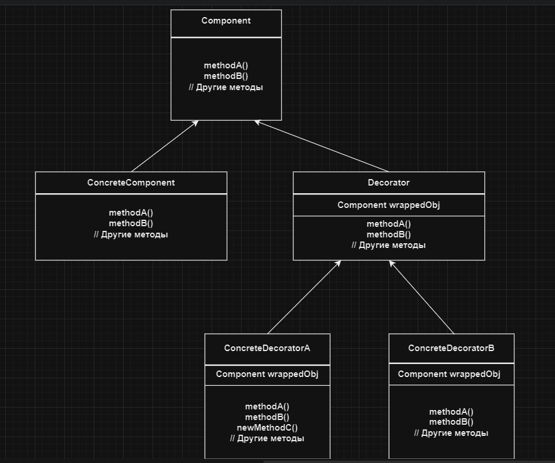

# Декоратор | Decorator

# Определение:
**Паттерн Декоратор** динамически наделяет объект новыми возможностями и является гибкой альтернативой
субклассированию в области расширения функциональности.

# Диаграмма классов:

</h2>