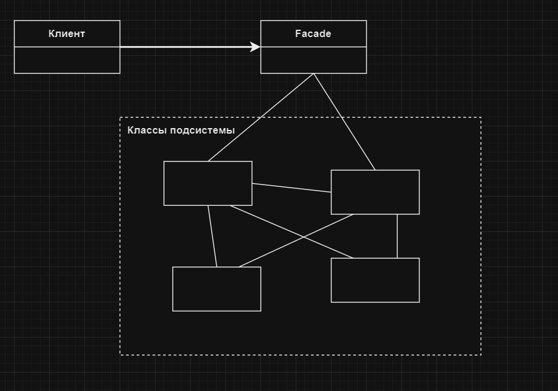

# Фасад | Facade

# Определение:
**Паттерн Фасад** предоставляет унифицированный интерфейс к группе интерфейсов подсистемы. 
Фасад определяет высокоуровневый интерфейс, упрощающий роботу с подсистемой.

# Диаграмма классов:

</h2>