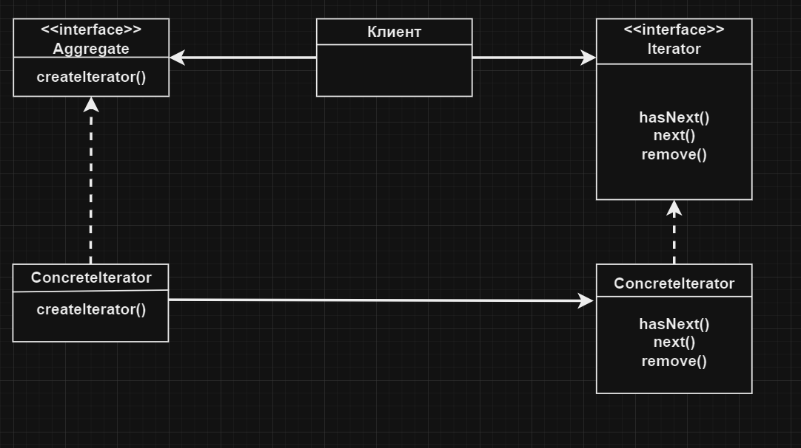

# Итератор | Iterator

# Определение:
Паттерн **Итератор** предоставляет механизм последовательного перебора элементов коллекции без раскрытия её
внутреннего представления.

# Диаграмма классов:

</h2>