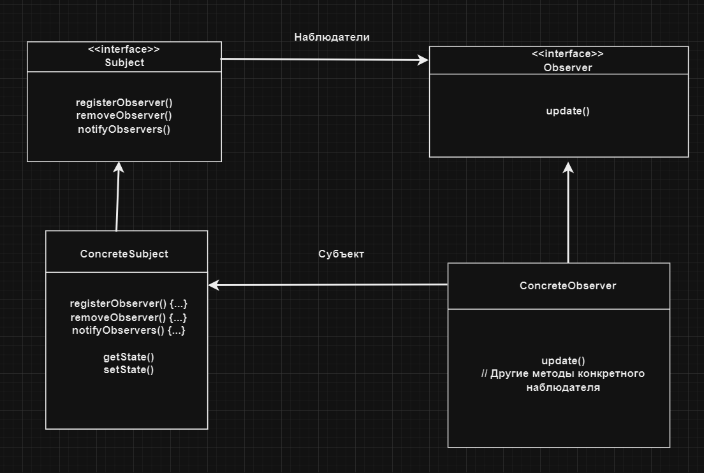

# Наблюдадель | Observer

# Определение: 
**Паттерн Наблюдатель** реализует отношение один ко многим таким образом, что при изменении одного объекта происходит
автоматическое оповезение и обновление зависимых объектов.

# Диаграмма классов:

</h2>
