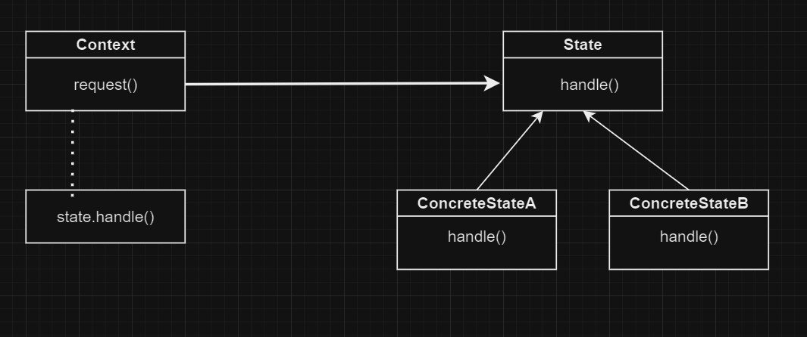

# Состояние | State

# Определение:
**Паттерн Состояние** управляет изменением поведения объекта при изменении его внутреннего состояния. 
Внешне это выглядит так, словно объект меняет свой класс.

# Диаграмма классов:

</h2>
