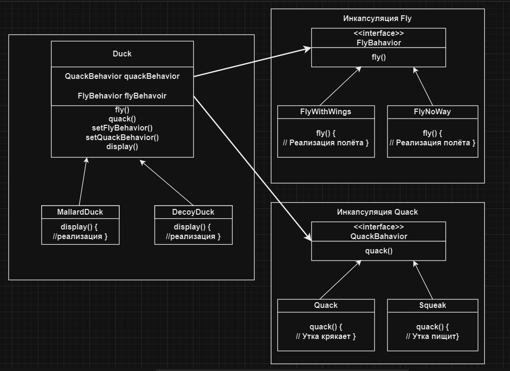

# Стратегия | Strategy

# Определение:
**Паттерн Стратегия** определяет семейство алгоритмов, инкапсулирует каждый их них и обеспечивает их взаимозаменяемость. 
Он позволяет модифицировать алгоритмы независимо от их использования на стороне клиента.

# Диаграмма классов:

</h2>