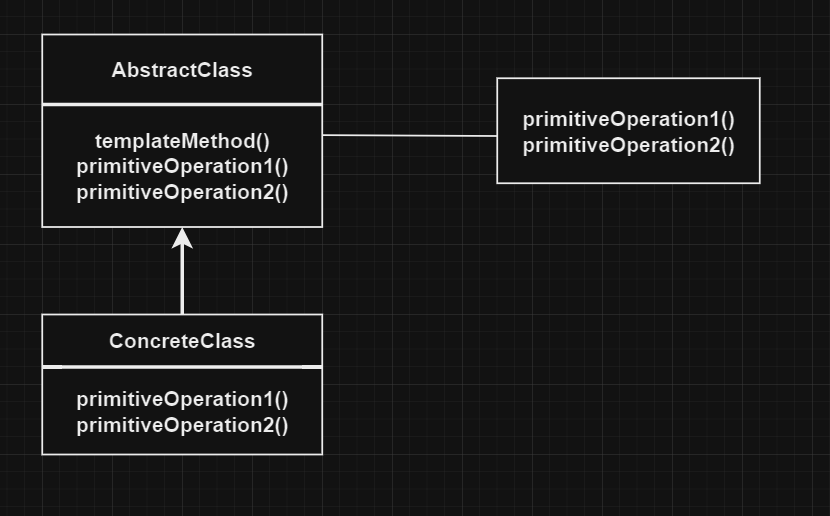

# Шаблонный метод | Template Method

# Определение:
Паттерн **Шаблонный метод** определяет "скелет" алгоритма в методе, оставляя определение реализации
некоторых шагов субклассам. Субклассы могут переопределять некоторые части алгоритма без имзенения
его структуры.

# Диаграмма классов:

</h2>